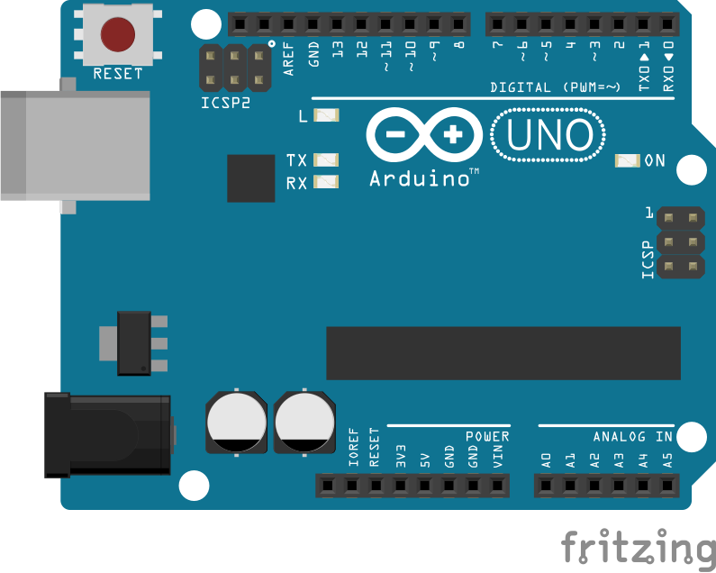
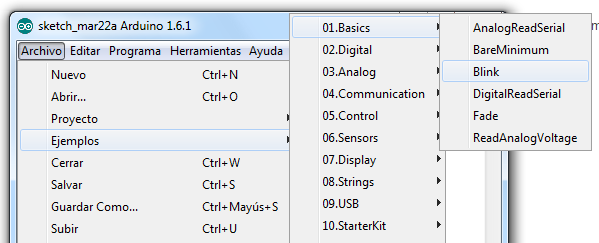
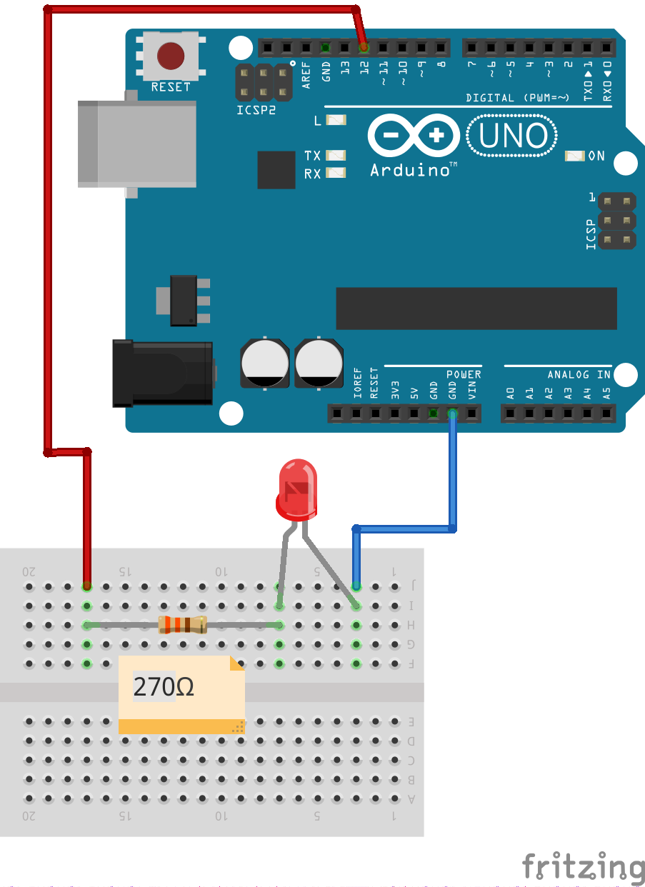

# Clase - 1

## Qué es Arduino?

Arduino es una plataforma de creación de electrónica de código abierto, la cual está basada en hardware y software libre, es flexible y fácil de utilizar.

## Porqué Arduino?

Porqué es una placa con todos los elementos necesarios para conectar periféricos a las entradas y salidas de un microcontrolador, y que puede ser programada tanto en Windows como macOS y GNU/Linux lo que nos permite vencer rápidamente las barreras que el desarrollo de hardware implica. Además es un proyecto que promueve la filosofía 'learning by doing', que viene a querer decir que la mejor manera de aprender es haciendo.

## Hola Mundo - Destello de un Led

En lugar del clásico **“hola mundo”** que es el primer programa que se hace cuando se aprende un lenguaje de programación, en Arduino el equivalente es el proyecto blink.



Para esto lo primero que haremos será abrir el IDE de arduino y cargar el programa **"Blink"** que se encuentra en **Archivo -> Ejemplos -> Basics -> Blink**.



El primer programa o sketch será hacer parpadear el led integrado que lleva Arduino.

### Código

```arduino{9}
void setup() {
  // inicializa el pin digital como salida.
  pinMode(LED_BUILTIN, OUTPUT);
}

// la función loop se ejecuta una y otra vez para siempre.
void loop() {
  digitalWrite(LED_BUILTIN, HIGH);   // prende el LED (HIGH es el nivel de voltaje)
  delay(1000);                       // espera un segundo
  digitalWrite(LED_BUILTIN, LOW);    // apaga el LED poniendo el voltaje en LOW
  delay(1000);                       // espera un segundo
}
```

::: tip Pregunta
Que pasa si cambiamos el valor dentro de la función **"delay"**?
:::

### Usando el protoboard y componentes del Kit

Ahora armaremos la siguiente configuración usando el kit.



::: danger Importante!
El led es un componente electrónico que permite el paso de la corriente en un solo sentido, por lo tanto ten en cuenta como lo conectas!
:::

## Pensando como programador

### Que es un Programa?

Un programa o algoritmo es una lista de instrucciones claras, ordenadas, objetivas
y precisas que describen un procedimiento para la solución de un problema. La
programación es una herramienta para la creación de programas informáticos que
realiza procedimientos de manera eficaz y eficiente, escritos en un lenguaje de
programación que la computadora interpreta y ejecuta.
Existen diversos lenguajes de programación que permiten a través de la lógica y el
análisis sistémico de los problemas secuenciar órdenes para procesar datos y en
base a ellos realizar ciertas funciones.

### Probando con juegos-blockly

Blockly es un un lenguaje de programación visual compuesto por bloques ensamblables, correspondientes a las distintas instrucciones de manera que programar se reduce a seleccionar y ensamblar ordenadamente las instrucciones que quieres ejecutar.

Entremos al siguiente Link:

[Juego](https://blockly-games.appspot.com/maze?lang=es&level=1&skin=2)
