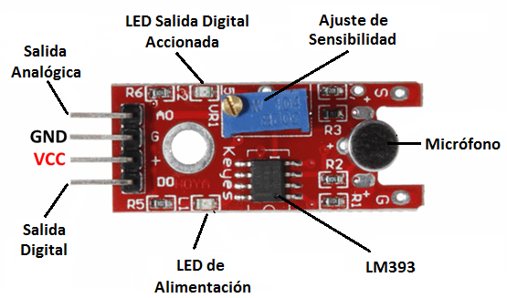
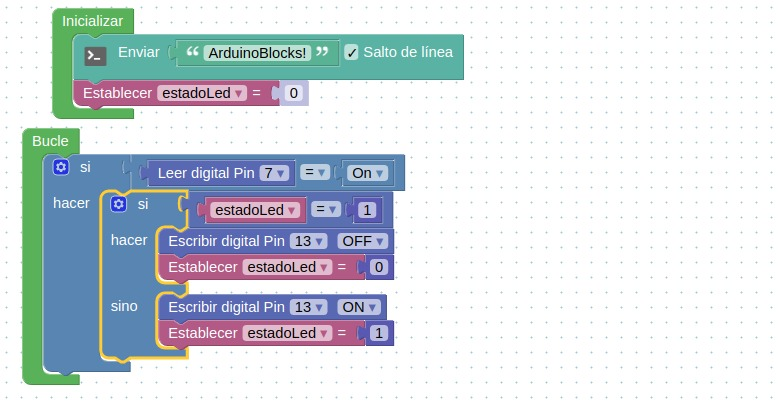
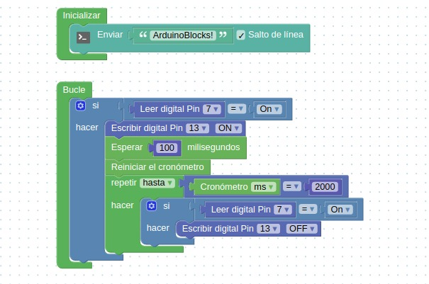

# Clase 3

## Estructuras de control

Las estructuras de control permiten tomar decisiones y realizar un proceso repetidas veces. Se trata de estructuras muy importantes, ya que son las encargadas de controlar el flujo de un programa.

## Algunas de las estructuras de control usadas en Arduino

### if

Se trata de una estructura de control que permite redirigir un curso de acción según la evaluación de una condición simple, sea falsa o verdadera.

Si la condición es verdadera, se ejecuta el bloque de sentencias 1; de lo contrario, se ejecuta el bloque de sentencias 2.

```js{9}
IF (Condición) THEN
(Bloque de sentencias 1)
ELSE
(Bloque de sentencias 2)
END IF

```

Se pueden plantear múltiples condiciones simultáneamente: si se cumple la (Condición 1) se ejecuta (Bloque de sentencias 1). En caso contrario se comprueba la (Condición 2); si es cierta se ejecuta (Bloque de sentencias 2), y así sucesivamente hasta n condiciones. Si ninguna de ellas es cumple se ejecuta (Bloque de sentencias else).

```js{0}
IF (Condición 1) THEN
(Bloque de sentencias 1)
ELSEIF (Condición 2) THEN
(Bloque de sentencias 2)
ELSE
(Bloque de sentencias else)
END IF

```

### Estructuras de control iterativas

### While

Mientras la condición sea verdadera, se ejecutarán las sentencias del bloque.

```js{0}
  While (Condición)
      (Bloque de sentencias)

```

### For

La sentencia <b>For</b> da lugar a un bucle, y permite ejecutar un conjunto de sentencias cierto número de veces.

- Primero, se evalúan las expresiones 1 y 2, dando como resultado dos números.
- La variable del bucle recorrerá los valores desde el número dado por la expresión 1 hasta el número dado por la expresión 2.
- El bloque de sentencias se ejecutará en cada uno de los valores que tome la variable del bucle.

```js{0}
   For (Variable) = (Expresión1) To (Expresión2) STEP (Salto)
      (Bloque de sentencias)
```

## Proyecto automatizar encendido de LED con sonidos.

### Módulo micrófono arduino

Un micrófono es un transductor que convierte la energía sonora en señales eléctricas. Micrófonos están disponibles en diferentes formas y tamaños.

El módulo que utilizaremos tiene dos salidas:

- AO: salida analógica, señal de voltaje de salida en tiempo real del micrófono
- DO: salida digital, cuando la intensidad del sonido alcanza un cierto umbral, la salida es una señal de nivel alto o bajo. La sensibilidad del umbral puede lograrse ajustando el potenciómetro.

Para asegurarse de que el micrófono pueda detectar tu voz o un sonido de palmas, se debe cambiar su sensibilidad girando el potenciómetro azul en el módulo.



### Encender y apagar un LED con un aplauso.

Utilizaremos la salida digital del sensor y la conectaremos al pin digital número 7 de la placa arduino.

[Arduino blocks](http://www.arduinoblocks.com/web/project/editordemo)



### Encender LED con un aplauso y apagarlo con dos aplausos.


