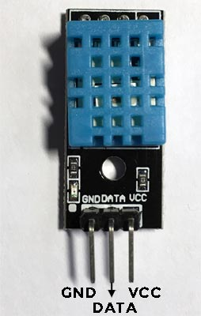
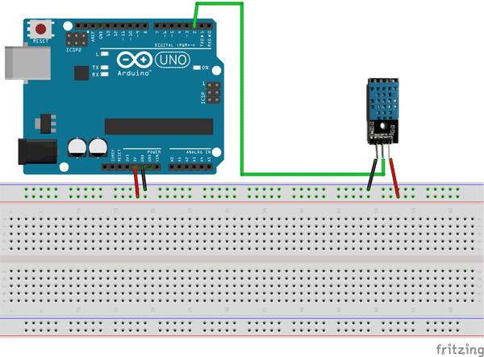
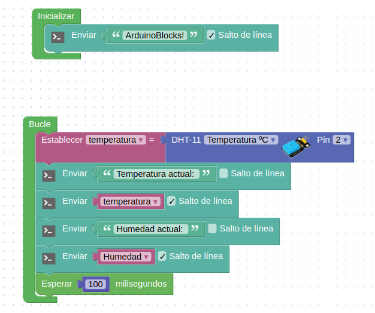

# Clase 4

## Poniendo en práctica los conceptos aprendidos.

### Proyecto humedad y temperatura de invernadero.

Para este proyecto utilizaremos el sensor de temperatura y humedad DHT-11. Para entender su funcionamiento y características técnicas el fabricante nos proporcionan los siguientes datos:

| **Hoja técnica** |                          |
| ---------------- | -----------------------: |
| Consumo          |                   2,5 mA |
| Señal de salida  |                  Digital |
| **Temperatura**  |                          |
| Rango            |            de 0ºC a 50ºC |
| Precisión a 25ºC |                    ± 2ºC |
| Resolución       |                      1ºC |
| **Humedad**      |                          |
| Rango            |       de 20% RH a 90% RH |
| Precisión        | entre 0ºC y 50ºC ± 5% RH |
| Resolución       |                    1% RH |

### Pines DHT-11

 
 

### Conexión con arduino

 

### Código

 

