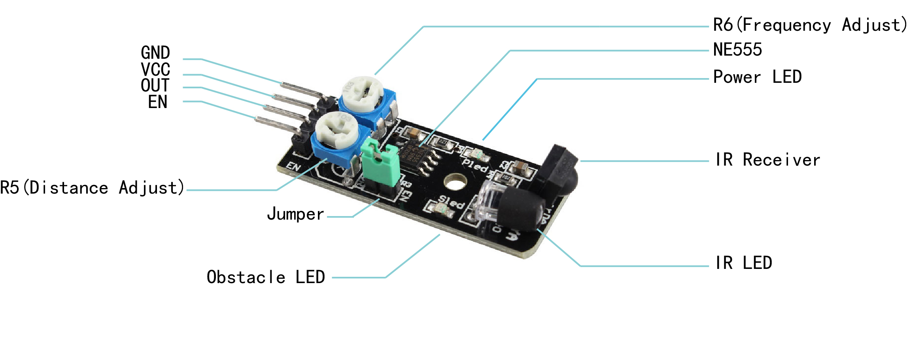
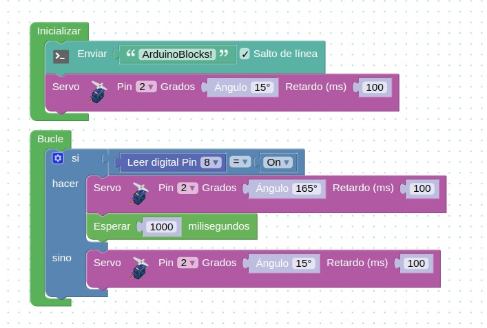

# Clase 5

## Sensor de obstáculos infrarrojo (IR)

El sensor de obstáculos infrarrojo emite una señal digital cuando detecta un objeto en su rango.
Está compuesto por un diodo emisor de infrarrojo y un receptor de infrarrojos. Al pasar un objeto delante del emisor, la luz es reflejada en el mismo y luego recibida por el receptor. Éste Último emite la señal digital en su pin de salida.

### Hoja técnica

| **Hoja técnica**     |                                                          |
| -------------------- | -------------------------------------------------------: |
| Voltaje de operación |                                               DC 3.3V-5V |
| Consumo              |                                                   ≥ 20mA |
| Señal de salida      | Digital TTL ( bajo detecta obstáculo, alto no obstáculo) |
| Angulo efectivo      |                                                      35º |

### Pines

 
 

## Proyecto fliper

 
 

[Arduino blocks](http://www.arduinoblocks.com/web/project/editordemo)

