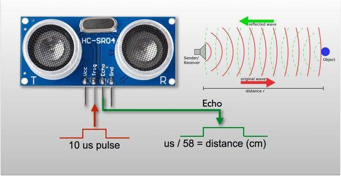
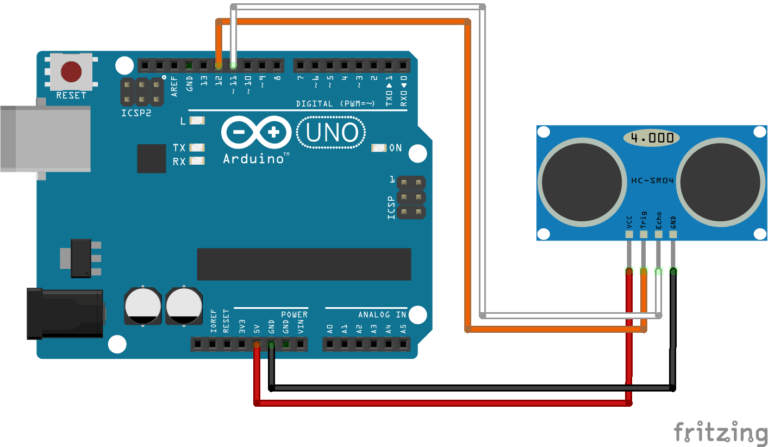

# Clase 6

## Sensor de distancia HC-SR04

El sensor HC-SR04 es un módulo que incorpora un par de transductores de ultrasonido que se utilizan de manera conjunta para determinar la distancia del sensor con un objeto colocado enfrente de este. Un transductor emite una “ráfaga” de ultrasonido y el otro capta el rebote de dicha onda. **El tiempo que tarda la onda sonora en ir y regresar** a un objeto puede utilizarse para conocer la distancia que existe entre el origen del sonido y el objeto, ya que conocemos la **velocidad del sonido**, la misma en la atmósfera terrestre es **343,2 m/s**.

 
 

### Conexión con arduino

 
 

## Proyecto detector de proximidad para ciegos.
