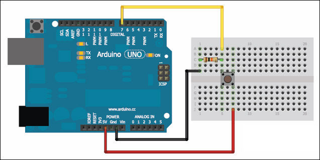
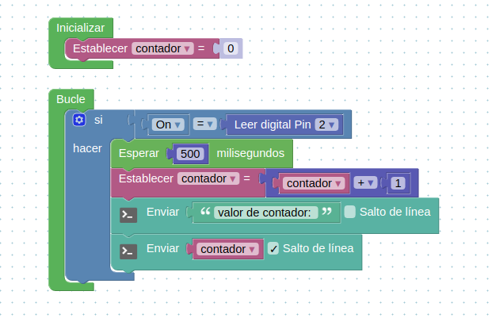
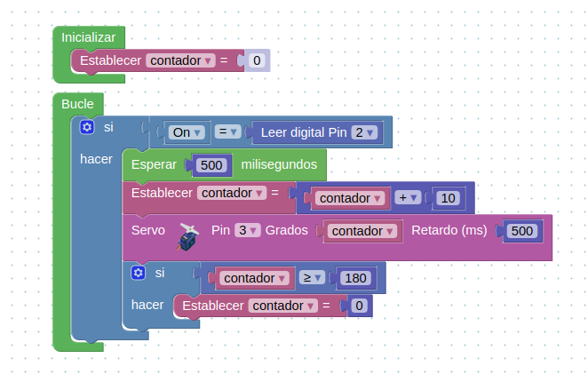

# Clase 7

## Pulsador

En esta clase realizaremos un contador de pulsos. La construcción de un contador es una de las técnicas más comunes en la realización programas.

Es una variable en la memoria que se incrementará cada vez que se ejecute el proceso.

El contador se utiliza para llevar la cuenta de determinadas acciones que se pueden solicitar durante la resolución de un problema.

En las instrucciones de preparación se realiza la inicialización del contador o contadores. La inicialización consiste en poner el valor inicial de la variable que representa al contador. Generalmente se inicializa con el valor 0.

Para poner en práctica este concepto utilizaremos el pulsador del kit, el mismo se debe conectar al arduino como muestra la figura siguiente.

 
 

### Desplegando en pantalla el contador de pulsos

 
 

## Moviendo el servo con un pulsador

 
 

