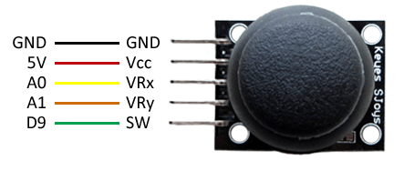

# Clase 8

## Joystick analógico

El montaje de este dispositivo es sencillo. En primer lugar, alimentamos el módulo conectando Vcc y GND, respectivamente, a 5V y GND de Arduino.

Para la medida analógica en ambos ejes, conectamos las salidas VRx y VRy a dos entradas analógicas de Arduino.

Finalmente, si también queremos la señal digital del pulsador, conectamos la salida SW a una entrada digital de Arduino. Vamos a usas las resistencias de Pull-Up internas de Arduino, por lo que no es necesario resistencias adicionales.

El esquema de montaje del joystick quedaría de la siguiente forma

 
 

## Armando un brazo robótico
