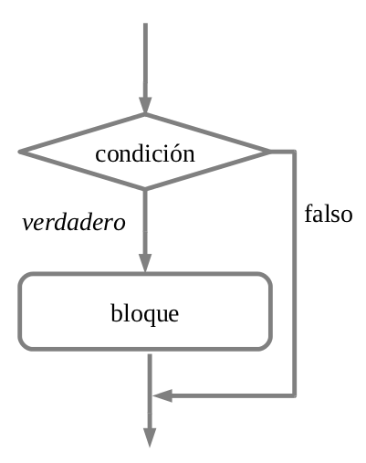
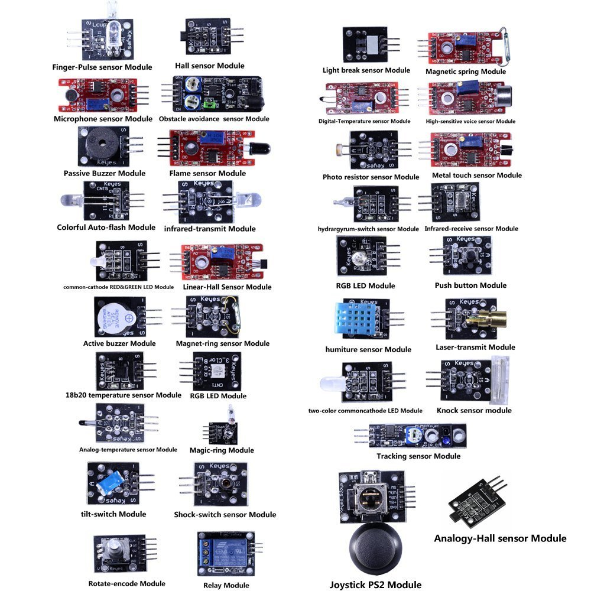
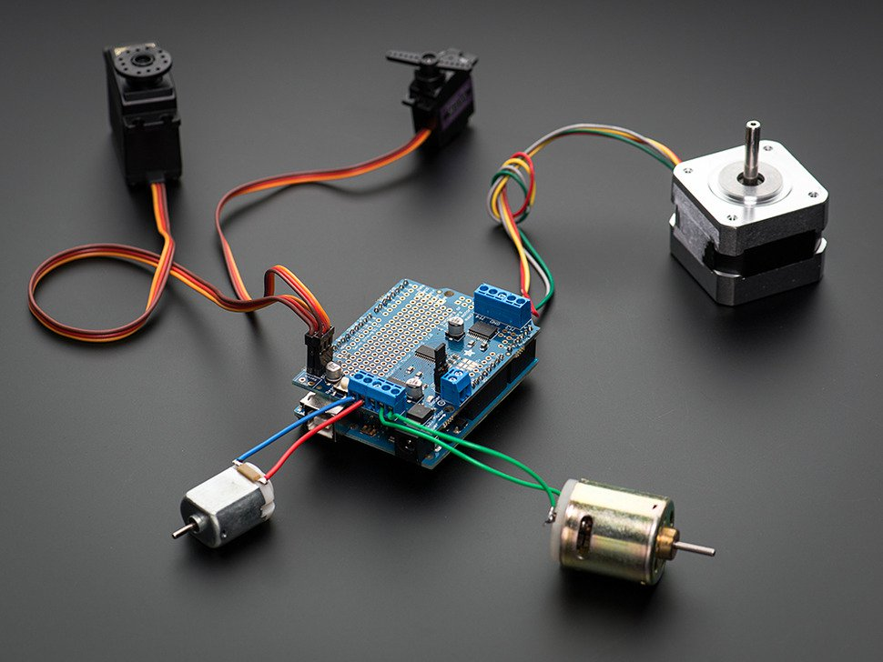
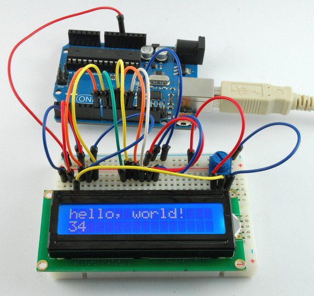
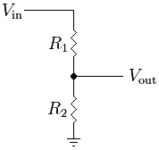
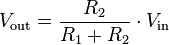

# Definiciones

## Algoritmo

Un algoritmo es una secuencia de pasos lógicos necesarios para llevar a cabo una tarea especifica, como la solución de un problema. Los algoritmos son independientes tanto del lenguaje de programación en que se expresan como de la computadora que los ejecuta.

## Archivo binario

Un archivo binario es un archivo informático que contiene información de cualquier tipo codificada en binario para el propósito de almacenamiento y procesamiento en ordenadores.

## Código abierto

El software de código abierto es el software cuyo código fuente y otros derechos que normalmente son exclusivos para quienes poseen los derechos de autor, son publicados bajo una licencia de código abierto o forman parte del dominio público.

## Hardware libre

Se llama hardware libre, hardware de código abierto o electrónica libre a aquellos dispositivos de hardware cuyas especificaciones y diagramas esquemáticos son de acceso público.

## Variable

En programación, las variables son espacios reservados en la memoria que, como su nombre indica, pueden cambiar de contenido a lo largo de la ejecución de un programa. Una variable corresponde a un área reservada en la memoria principal del ordenador.

## Operadores

Los operadores son un tipo de símbolo que pueden aparecer en las expresiones, e indican al compilador la realización de determinadas operaciones matemáticas, lógicas y numéricas. Se pueden aplicar a variables u otros objetos denominados operandos y su efecto es una combinación de las siguientes acciones.

- Producir un resultado-valor
- Alterar un operando
- Designar un objeto o función

## Estructuras de control

Las instrucciones de un programa se ejecutan en forma secuencial, comenzando por la primera instrucción y siguiendo en orden hasta la última, ejecutándose todas ellas, una sola vez. Las estructuras de selección e iteración permiten modificar el flujo de ejecución de las instrucciones del programa.

## Hoja de datos

Es un documento que resume el funcionamiento y otras características de un componente (por ejemplo, un componente electrónico) o subsistema (por ejemplo, una fuente de alimentación) con el suficiente detalle para ser utilizado.

## Sensor

Un sensor es un dispositivo que está capacitado para detectar acciones o estímulos externos y responder en consecuencia. Estos aparatos pueden transformar las magnitudes físicas o químicas en magnitudes eléctricas.
Los sensores se pueden clasificar en función de los datos de salida en:

- Digitales
- Analógicos

## Actuador

Un actuador es un dispositivo capaz de transformar energía hidráulica, neumática o eléctrica en la activación de un proceso con la finalidad de generar un efecto sobre elemento externo.
Existen varios tipos de actuadores como son:

- Electrónicos
- Hidráulicos
- Neumáticos
- Eléctricos
- Motores
- Bombas

## Periférico

Periférico es la denominación genérica para designar al aparato y/o dispositivos auxiliares e independientes conectados a la unidad central de procesamiento de una computadora. Se consideran periféricos a las unidades o dispositivos de hardware a través de los cuales la computadora se comunica con el exterior.

## Tensión eléctrica

La diferencia de potencial o voltaje (V) es una magnitud física que cuantifica la diferencia de potencial eléctrico entre dos puntos.
La tensión entre dos puntos **A** y **B** es independiente del camino recorrido por la carga y depende exclusivamente del potencial eléctrico de dichos puntos **A** y **B**

## Corriente eléctrica

La corriente eléctrica (A) es el flujo de carga eléctrica que recorre un material. Se debe al movimiento de las cargas (normalmente electrones) en el interior del mismo. Al caudal de corriente (cantidad de carga por unidad de tiempo) se le denomina intensidad de corriente eléctrica.

## Resistencia eléctrica

Se le denomina resistencia eléctrica a la oposición al flujo de electrones al moverse a través de un conductor. La unidad de resistencia en el Sistema Internacional es el ohmio, que se representa con la letra griega omega (Ω)

## Divisor de voltaje resistivo

Un divisor de voltaje resistivo es una configuración de un circuito eléctrico que reparte la tensión de una fuente entre una o más resistencias conectadas en serie.

## Conversor analógico-digital (ADC):

Es el proceso mediante el cual se convierte una magnitud física como un voltaje, corriente, temperatura, etc. en un número binario (o señal digital) con el propósito de facilitar su manejo por circuitos digitales como un CPU.

## Salida digital

Se trata de pines donde el usuario puede activar (poner tensión) o desactivar (quitar tensión). Es similar a escribir **0** y **1**, en arduino se traduce a **0V** y **5V**.

## Frecuencia

La frecuencia es una magnitud que mide el número de repeticiones por unidad de tiempo de cualquier fenómeno o suceso periódico.

## Período

Un período de tiempo es el tiempo necesario para que un ciclo completo de vibración pase en un punto dado.​ A medida que la frecuencia de una onda aumenta, el período de tiempo de la onda disminuye. La unidad para el período de tiempo es 'segundos'.

## Referencias

- [Wikipedia](https://es.wikipedia.org/wiki)
- [fing](https://www.fing.edu.uy/inco/cursos/fpr/wiki)
- [aprendiendo arduino](https://aprendiendoarduino.wordpress.com)
