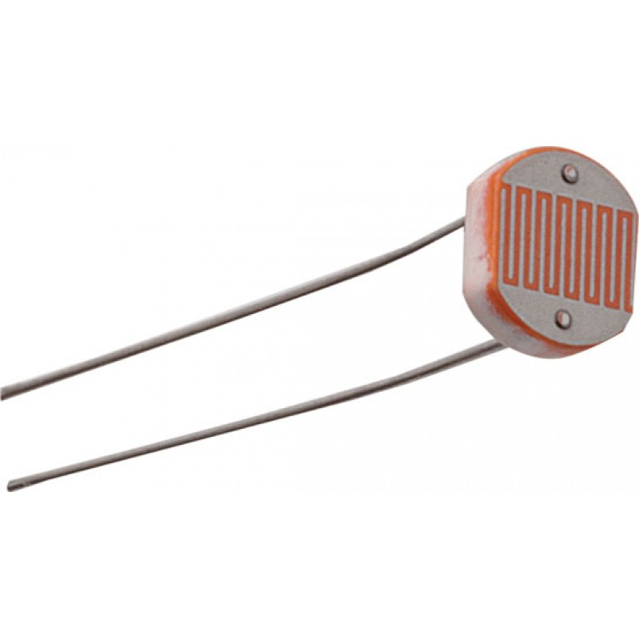
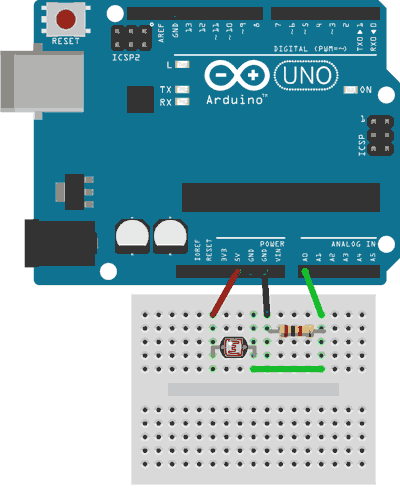
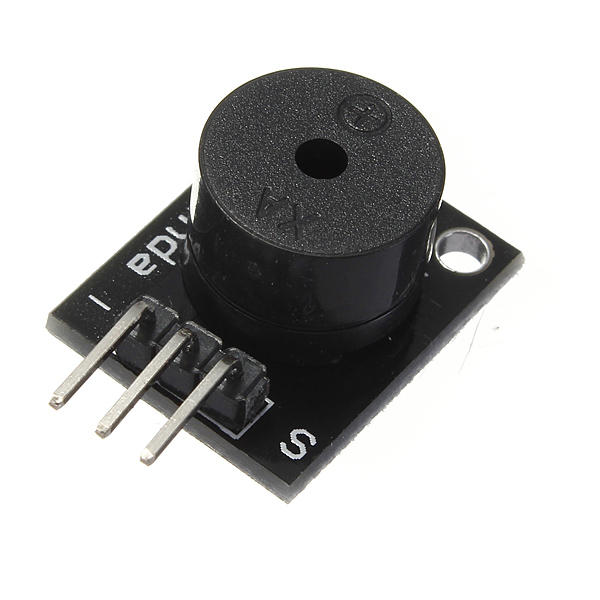
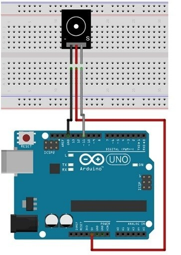

# Componentes en el kit

## Fotoresistencia LDR

Es un sensor cuya resistencia varía sensiblemente con la cantidad de luz percibida. Puede también ser llamado fotoconductor, célula fotoeléctrica o resistor dependiente de la luz, cuyas siglas, LDR, se originan de su nombre en inglés light-dependent resistor.



### Comportamiento

- Mas luz = menor resistencia eléctrica
- Menos luz = mayor resistencia eléctrica

### Conceptos importantes

- [Divisor de voltaje](/definiciones/#divisor-de-voltaje-resistivo)
- [Conversión analógico-digital (ADC)](/definiciones/#conversor-analogico-digital-adc)

### Configuración básica


 
### Código ejemplo

```arduino{0}

const int LEDPin = 13;
const int LDRPin = 2;

void setup()
{
pinMode(LEDPin, OUTPUT);
pinMode(LDRPin, INPUT);
}

void loop()
{
int value = digitalRead(LDRPin);
if (value == HIGH)
{
digitalWrite(LEDPin, HIGH);
delay(50);
digitalWrite(LEDPin, LOW);
delay(50);
}
}

```

## Buzzer

Un buzzer pasivo o un altavoz son dispositivos que permiten convertir una señal eléctrica en una onda de sonido.



### Comportamiento

Los buzzer son transductores piezoeléctricos. Los materiales piezoeléctricos tiene la propiedad especial de variar su volumen al ser atravesados por corrientes eléctricas.


Un buzzer aprovecha este fenómeno para hacer vibrar una membrana al atravesar el material piezoeléctrico con una señal eléctrica.

### Conceptos importantes

- [Salida digital](/definiciones/#salida-digital)
- [Frecuencia](/definiciones/#frecuencia)

### Configuración básica


 
### Código ejemplo

```arduino{0}

const int pinBuzzer = 11;

void setup()
{
}

void loop()
{
  //generar tono de 440Hz durante 1000 ms
  tone(pinBuzzer, 440);
  delay(1000);

  //detener tono durante 500ms
  noTone(pinBuzzer);
  delay(500);

  //generar tono de 523Hz durante 500ms, y detenerlo durante 500ms.
  tone(pinBuzzer, 523, 300);
  delay(500);
}

```

## Servo
